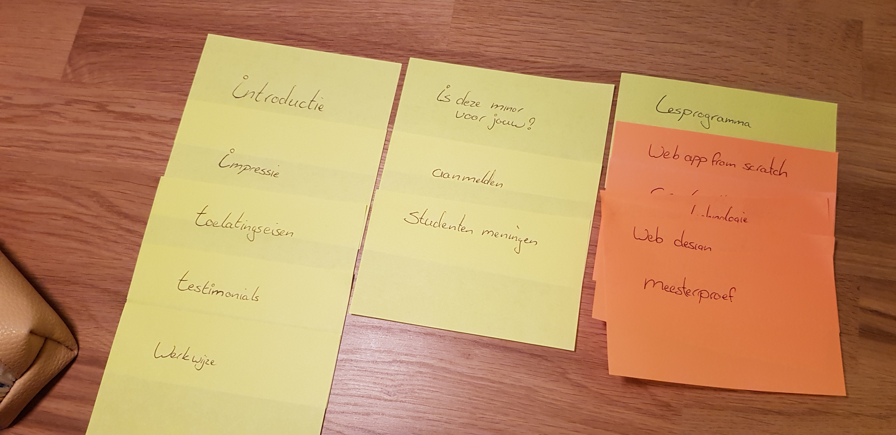
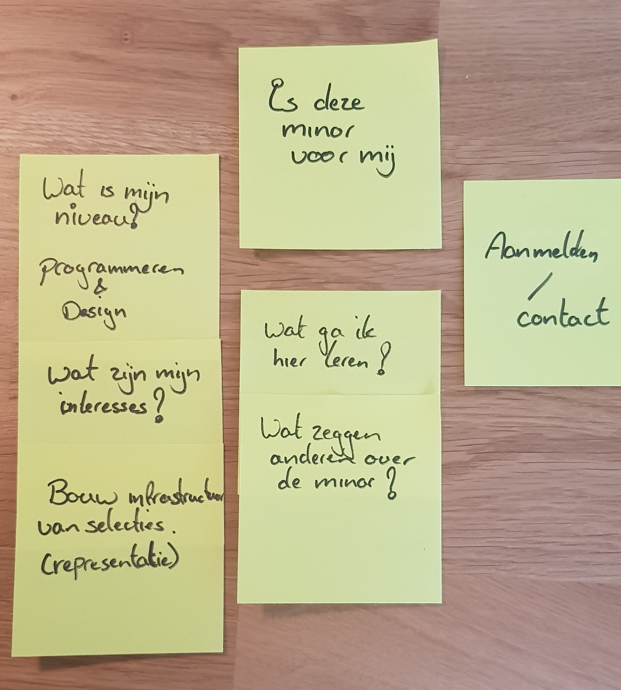
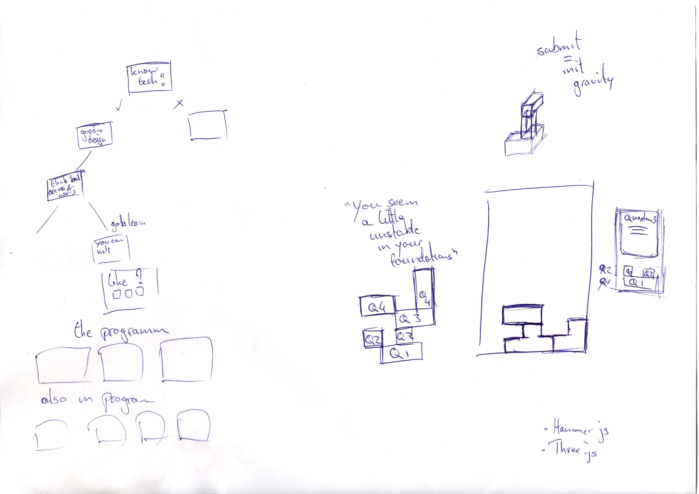
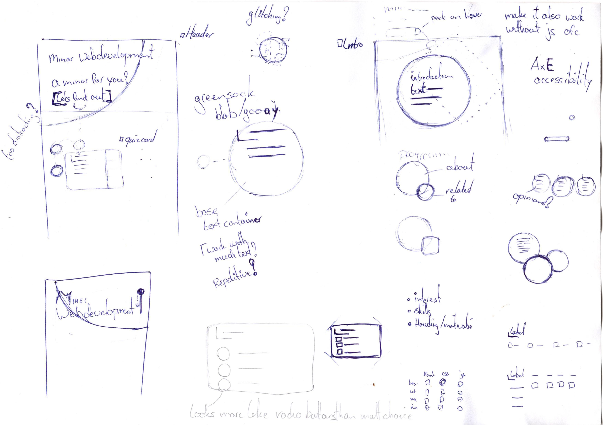
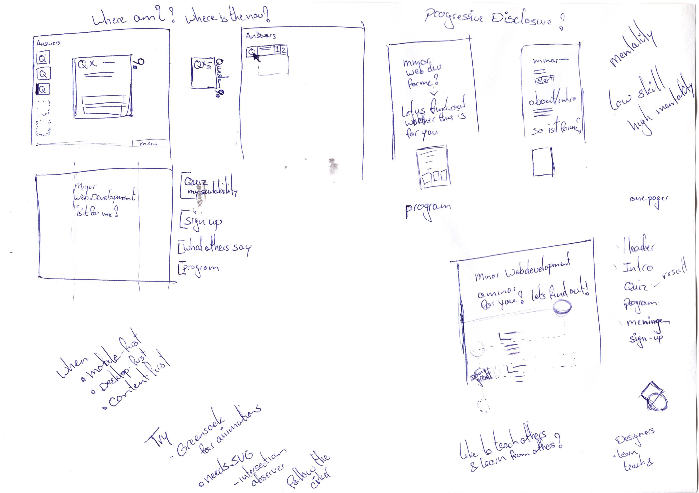
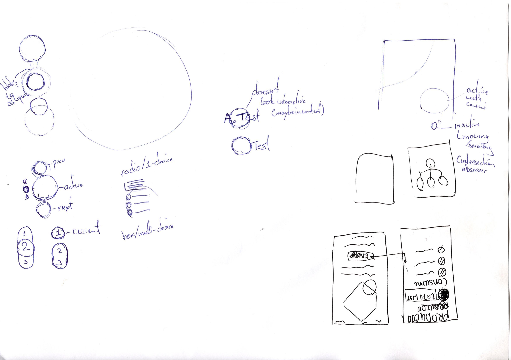
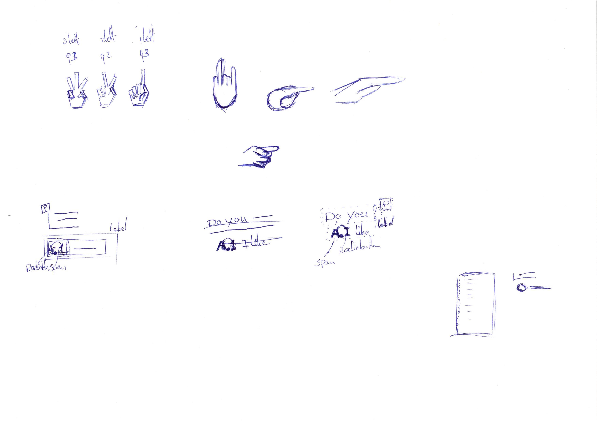
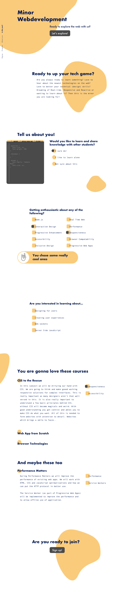

# Website Minor Everything Web CMD (re-design)

A re-design of the Minor Everything Web (Web Development) at HvA by the course Communication and Multimedia Design (CMD). Re-design started based on this [website](https://cmda.github.io/minor-everything-web/) of 20-04-2018 (Dutch)

Redesign can be found [here](https://kyunwang.github.io/minor-everything-web-website/)

# Table of Content

- [Getting started](#Getting-started)
- [User scenario](#User-scenario)
- [Design](#design)
  - [Card sorting](#Card-sorting)
  - [Sketched](#Sketches)
  - [Digital design](#Digital-design)
  - [Digital feedback](#Digital-feedback)
- [User test](#User-test)
- [Principles](#Principles)
- [Changes for school](#Changes-for-school)

## Getting started

Here is how to get started with this project

Download or clone the repo git clone: https://github.com/kyunwang/minor-everything-web-website.git

- Run cd to the directory
- Run `npm i`
- Run `npm run dev`
- Go to `localhost:4050` and you are ready to go.

## User scenario

An ICT student mainly focused on the back-end part of the web is looking for an minor. His goal for a minor is one which will up his game in programming. He is not too interested in styling as he reckons that it is easy, but he only reaches out to CSS frameworks like bootstrap for instance.

The goal of this re-design is to inform him about the minor in a jolly way. And confront him about the challenges that CSS brings for custom styling especially. We want to interest him and let him make a clear choice whether the minor is something for him at all.

## Design

The design process in pictures can be found below.

Starting from card storting to sketches, design and ending with design feedback.

### Card sorting

Sorting current content and restructuring

### Sketches

Random sketches (not the most organized I must say)

### Digital design

Start design to use as starting point for code and testing with users

Click this to show

### Design feedback

Feedback from during the design process (static)

- At the start the tone of voice was too general. Now we are light hearted and also focus on specific domains based their answers. (lightly)
- Not all hierarchy were consistent yet
  - Have been streamlined and made consistent
- The position and goal of the CSS editor was not logical and too abrupt
  - Currently it will start with a inline modal to introduce and determine thegoal for the user to make the purpose clearer.

Feedback from after designing and code (dynamic)

- The checkbox/radiobutton checked color are not the same as the text color
  - the text color is pure black which was too harsh in contrast and overlap of the yellow tone
- Context might be lost in the program section when many programs are opened. Each program sections head can be given a position sticky to keep context
  - Have checked this and it is a valid point. Currently it needs some rewriting to make it possible.

## User test

Every note made from the tests:

- Feedback from the quiz was liked
- Understood he (yes he) was suitable after question 1
- Didn't knwo what _real time web_ refered to. This made him read the subject in the program section in detail.
- The introduction text was deemed too long and skipped for later
- The design was liked
- Started using the devtools as styler at the start (was because of the `TIP: ...` has been changed since then)
- The unstyled form was not per se found hidious (thinking that it was supposed to be so)
- Needed a introduction/heads up about the CSS editor (has been added with the inline modal)
- Side menu was deemed as a meta menu or going to another page and not a page indicator
  - Not all tests where like this
- Button animation felt too slow
- The CTA at the top was ignored because he saw content at the bottom indicating more content
- The CSS editor CTA modal was ignored till after the selection of a answer (Colors have been inverted and the modal has been re-positioned to cathc attention)
- The `style for me` transitioning was liked
- The line-breaks in the editor were confusing (The editor has been made wider to prevent this)
- The editor had no syntax highlighting which made it harder to use (Highlighting has been added)
- At first the programs didn't seem to be clickable to expand. Thanks to the pointer it was noticed.
- The opening animation seemed too subtle for some of the program

## Principles

Few principles used which are listed on [bokardo](http://bokardo.com/principles-of-user-interface-design/)

- Keep users in control

- One primary action per screen - Exception of a specific context ish break to guide attention

- Provide a natural next step

- Consistency matters - can be used to _break_ attention/context for a specific goal

- Strong visual hierarchies work best

- Smart organization reduces cognitive load

## Changes for school

- The flow is now finite. As it is now a single page website with distinct steps. The user gets introduces to the minor, get confronted with CSS (for the ICT student), defines his/her/(whatever way you want to be called) preferences at each question, gets a overview of the subjects given based on their choices and can then decide to sign up or not.

- The motivation of the student is orientation and deciding whether he/she/`your input` would like to your the minor. We will hook into the motivation and decide by their input whether they are suitable to your or not, albeit the ultimate choice lies at their side.

- The flow ends with an sign up button which currently mocks signing up. As there is currently no other way than signing up with SIS (a HvA portal) or mailing lecturers, the button now redirects to [sis.hva.nl](sis.hva.nl)

- There is no need to to open content anymore except for the program. The rpogram is toggle based to enable a clear overview of all the programs

- With the first question of the quiz we already indicate whether the user (ICT student) is suitable for the minor. The minor really encourages sharing knowledge between the student, so someone who rather likes to work alone can be deemed not suitable. That said the feedback given will be based on their answer.

- Question 1 will show the user whether they are suitable for the minor. Based on the principle of the minor: Teaches and learning from each other

- Question 2 will sort the overview of the subjects(program) based on their interest/answer. And give light hearted responses ont heir answer

- Question is about specific domains/subjects given during the minor and will show a bit more information as feedback on their answer(s).

- By a subtle navigation and location indication the user can always see which section they are on the page.

**Credits**

- Hand icon is from [juliebonnemoy.com](https://juliebonnemoy.com/)
  (Shoot me a message if I need to remove it)
- The CSS Editor animation is from my fellows during the minor from [here](https://github.com/baskager/redesign-minor-web-dev/blob/develop/app/src/js/the-wow-header.js)
